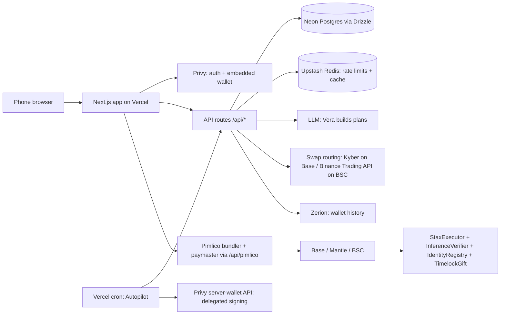

# Architecture

<!-- Keep to one screen. Update when a boundary moves, not when a file moves. -->

## System map

## Components

| Component | Path | Runtime | Owns |
|---|---|---|---|
| Web app | `web/src/app/`, `web/src/components/` | Next.js 16 on Vercel | UI, Lite/Pro modes, landing, beta page, admin console |
| API | `web/src/app/api/` | Vercel Node functions | validation, plan building, DB writes, signing plans, gift attestations |
| Chain registry | `web/src/lib/chains/` | shared | one `StaxChain` per network: assets, routers, contracts, explorer |
| Account abstraction | `web/src/lib/aa.ts`, `web/src/lib/server/privySmartAccount.ts` | browser / server | ERC-4337 SimpleAccount user ops, sponsored by Pimlico |
| Contracts | `contracts/` | Hardhat, deployed on Base and Mantle | on-chain plan check, execution, agent identity, gift escrow |
| Autopilot | `web/src/app/api/cron/autopilot/` | Vercel cron | recurring invests with delegated server signing |

## Data

- Store: Neon Postgres through Drizzle ORM.
- Schema source of truth: `web/src/lib/db/schema.ts`; migrations in `web/drizzle/`.
- Migrations: `npm run db:generate` locally; `db:migrate:deploy` runs inside the Vercel build.
  A production migration is a human gate.

## External services and trust boundaries

| Service | Used for | Credential location | Trust |
|---|---|---|---|
| Privy | auth, embedded wallets, delegated server signing | Vercel env (`PRIVY_*`) | trusted for identity; email trusted only from verified OAuth providers |
| Pimlico | ERC-4337 bundler + paymaster | Vercel env, proxied so the key never reaches the browser | untrusted data |
| KyberSwap | Base swap routing | public API | untrusted: routes re-requested without PMM sources |
| Binance Web3 API | BSC: RWA data, market, trading, transaction simulation, wallet | `local.env` locally, Vercel env in prod | untrusted data |
| Zerion | wallet history | Vercel env | untrusted data |
| Alchemy / Dwellir | RPC reads | Vercel env | untrusted data |

## Key invariants

- The contract, not the AI, is authoritative: every investment goes through
  `StaxExecutor.investWithAI`, which reverts unless `InferenceVerifier` accepts Vera's signature
  and the risk ceiling. Exception to decide for BSC: see `PRODUCT.md` open questions.
- Approvals are exact-amount per leg and reset to zero after the leg.
- A route that already has a transaction receipt is never reported to the user as failed; the
  server re-reads the chain with retries, and the gift list self-heals stale rows.
- No secret reaches the browser. `NEXT_PUBLIC_*` values are public by construction.
- Every user op sent on Base carries the ERC-8021 builder-code suffix on its callData.

## Verify

`npm run verify` in `web/` = `tsc --noEmit` + `eslint src` + `vitest run`.
`npm run build` = verify + production migration + `next build` (Vercel runs this).
